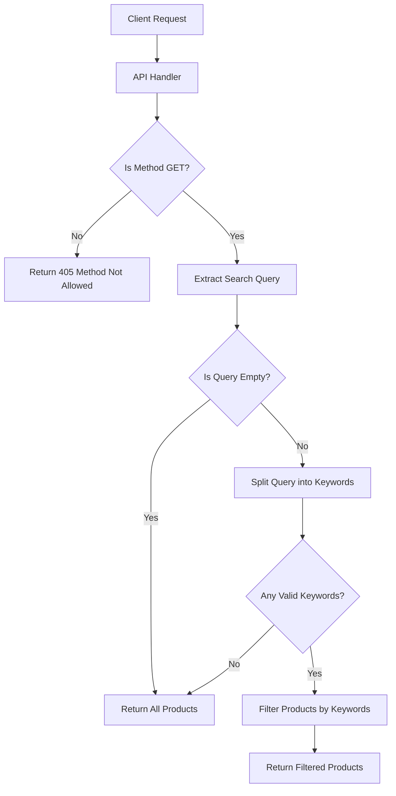

# Product Search API Flow

This document outlines the flow of the product search API endpoint that handles searching through product data.

## API Endpoint Overview

The endpoint is designed to filter products based on keywords provided in the search query parameter.

```typescript
GET /api/search?search=keyword1 keyword2
```

## Request Flow Diagram



## Code Implementation

The implementation handles search queries through the following process:

```typescript
// API handler function
export default function handler(req: NextApiRequest, res: NextApiResponse) {
  // Only allow GET requests
  if (req.method !== 'GET') {
    res.setHeader('Allow', ['GET']);
    return res.status(405).end(`Method ${req.method} Not Allowed`);
  }

  try {
    // Get and normalize search query
    const searchQuery = ((req.query.search as string) || '').trim();
    
    // If no search query, return all data
    if (!searchQuery) {
      return res.status(200).json(smallData);
    }

    // Split into keywords and filter out empty strings
    const keywords = searchQuery.toLowerCase().split(/\s+/).filter(Boolean);
    
    // If no valid keywords after filtering, return all data
    if (keywords.length === 0) {
      return res.status(200).json(smallData);
    }
    
    // Filter products that match any keyword
    const filteredData = smallData.filter(product => {
      const name = product.name.toLowerCase();
      return keywords.some(keyword => name.includes(keyword));
    });
    
    return res.status(200).json(filteredData);
  } catch (error) {
    console.error('Error processing search request:', error);
    return res.status(500).json({ error: 'Internal server error' });
  }
}
```

## Example Usage

### Frontend Implementation

Here's an example of how to use this API endpoint in a React component:

```jsx
import { useState, useEffect } from 'react';

export default function ProductSearch() {
  const [query, setQuery] = useState('');
  const [products, setProducts] = useState([]);
  const [loading, setLoading] = useState(false);

  const searchProducts = async () => {
    setLoading(true);
    try {
      const response = await fetch(`/api/search?search=${encodeURIComponent(query)}`);
      const data = await response.json();
      setProducts(data);
    } catch (error) {
      console.error('Error fetching products:', error);
    } finally {
      setLoading(false);
    }
  };

  return (
    <div>
      <div className="search-container">
        <input
          type="text"
          value={query}
          onChange={(e) => setQuery(e.target.value)}
          placeholder="Search products..."
        />
        <button onClick={searchProducts} disabled={loading}>
          {loading ? 'Searching...' : 'Search'}
        </button>
      </div>

      <div className="results-container">
        {products.length === 0 ? (
          <p>No products found</p>
        ) : (
          products.map((product) => (
            <div key={product.id} className="product-card">
              <h3>{product.name}</h3>
              {/* Additional product information */}
            </div>
          ))
        )}
      </div>
    </div>
  );
}
```

## Performance Considerations

- The search implementation uses a simple `includes()` method to match keywords, which works well for small datasets.
- For larger datasets, consider implementing more sophisticated search algorithms or using a dedicated search service.
- The API currently returns all products when no search query is provided, which is efficient for small datasets but might need pagination for larger collections.

## Future Improvements

Potential enhancements to consider:

1. Add pagination support for large result sets
2. Implement fuzzy matching for better search results
3. Add filtering by product categories or other attributes
4. Implement result sorting options
5. Add search analytics to track popular search terms