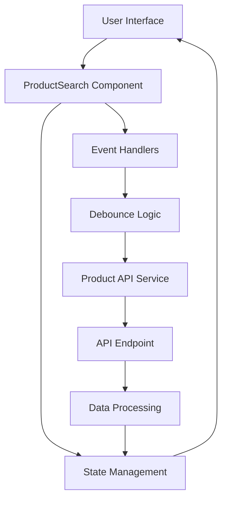
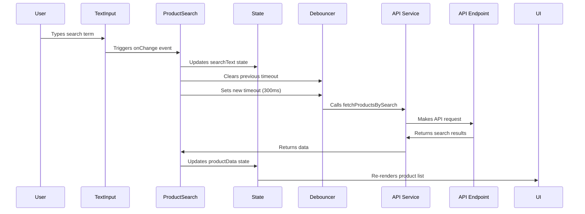
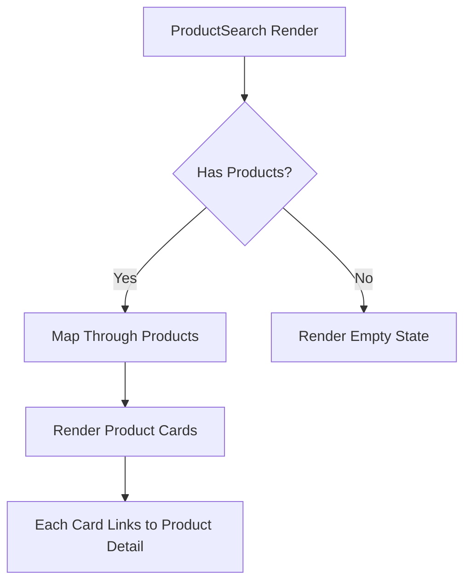
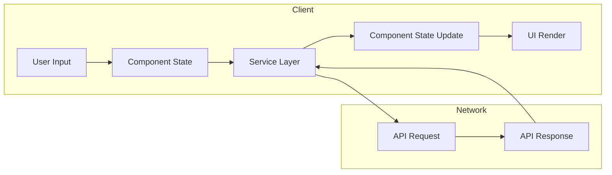

# Product Search Component Flow

This document outlines the flow and architecture of the ProductSearch component, which provides a real-time product search experience with debounced API calls.

## Architecture Overview

The ProductSearch component implements a modern search flow using React hooks and a service-based architecture. It follows the principles of separation of concerns by isolating the API calls into a dedicated service module.



## Component Flow

### 1. Component Initialization

When the ProductSearch component mounts:
1. It imports the required dependencies, including the `fetchProductsBySearch` API service
2. Initializes state with default product data from the mock data
3. Sets up the debounce timer reference with `useRef`

```jsx
const data = [...smallData];
const [productData, setProductData] = useState(data);
const [searchText, setSearchText] = useState('');
const debounceTimeout = useRef<NodeJS.Timeout | null>(null);
```

### 2. User Input Handling

When the user types in the search input:



The input handling process:
1. Captures the input value from the event
2. Updates the searchText state immediately (for UI feedback)
3. Clears any existing debounce timeout
4. Sets a new timeout to delay the API call by 300ms

```jsx
const onChange = (e: React.ChangeEvent<HTMLInputElement>) => {
  const value = e.target.value;
  setSearchText(value);

  if (debounceTimeout.current) {
    clearTimeout(debounceTimeout.current);
  }

  debounceTimeout.current = setTimeout(() => {
    fetchProducts(value);
  }, 300);
};
```

### 3. API Request Flow

The API request process:
1. The debounced timeout triggers `fetchProducts()`
2. `fetchProducts()` calls the external service `fetchProductsBySearch()`
3. The service makes the actual API request
4. The service processes the response and returns the data
5. The component updates its state with the new data

```jsx
const fetchProducts = async (val: string) => {
  const data = await fetchProductsBySearch(val);
  setProductData(data);
};
```

### 4. Rendering Flow



The render flow:
1. The search input is always displayed at the top
2. The product data state determines what is rendered in the main area
3. If products exist, they're mapped to product cards
4. If no products match, an EmptyState component is displayed
5. Each product card is a link to its detail page

## Service Layer

The key improvement in this implementation is the extraction of API calls to a dedicated service:

```jsx
// Imported from '@/src/services/productAPI'
import { fetchProductsBySearch } from '@/src/services/productAPI';
```

This service likely contains:

```jsx
// src/services/productAPI.js
export async function fetchProductsBySearch(searchTerm) {
  try {
    const response = await fetch(`/api/products?search=${searchTerm}`);
    const data = await response.json();
    return data;
  } catch (error) {
    console.error('Error fetching products:', error);
    return [];
  }
}
```

### Benefits of Service-Based Architecture

1. **Separation of Concerns**: The component focuses on UI and state management while the service handles data fetching
2. **Reusability**: The same service can be used across multiple components
3. **Testability**: Services can be mocked easily for unit testing
4. **Maintainability**: API changes only need to be updated in one place

## Data Flow Diagram



## Client-Side Search Option

The component maintains the ability to perform client-side filtering, although this is not actively used:

```jsx
const searchProductsByName = (products: any[], keyword: string) => {
  const keywords = keyword.toLowerCase().split(/\s+/);
  return products.filter((product) => {
    const name = product.name.toLowerCase();
    return keywords.some((word) => name.includes(word));
  });
};
```

This provides flexibility to switch between client and server-side filtering as needed.

## Performance Optimizations

### 1. Debouncing

The most significant optimization is the debouncing of search requests:

```jsx
debounceTimeout.current = setTimeout(() => {
  fetchProducts(value);
}, 300);
```

Benefits:
- Reduces the number of API calls during typing
- Improves server load and client performance
- Provides a smoother user experience

### 2. Service Abstraction

Using a dedicated API service reduces redundant code and enables:
- Centralized error handling
- Consistent request formatting
- Potential for request caching
- Easier implementation of retry logic

## Future Enhancement Opportunities

The commented-out pagination code suggests plans for:


Other potential enhancements:
1. **Implement Pagination**: Enable viewing large result sets
2. **Add Loading States**: Show loading indicators during API requests
3. **Implement Error Handling**: Handle and display API errors
4. **Add Filtering Options**: Filter by category, price range, etc.
5. **Add Sorting**: Sort results by different criteria
6. **Implement Caching**: Cache recent search results
7. **Add Search Analytics**: Track popular search terms

## Implementation Best Practices

This component demonstrates several React best practices:
1. **Functional Components**: Uses modern React functional components
2. **React Hooks**: Leverages useState and useRef for state management
3. **Debouncing**: Optimizes performance by reducing unnecessary API calls
4. **Service Abstraction**: Separates concerns between UI and data fetching
5. **Conditional Rendering**: Shows appropriate UI based on state
6. **Responsive Design**: Uses Tailwind CSS for responsive layouts